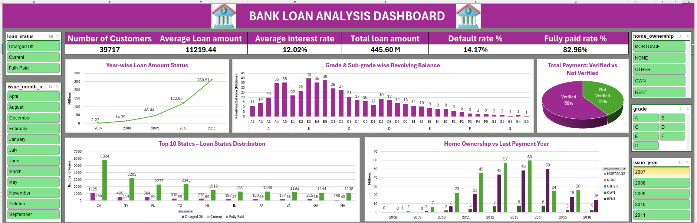
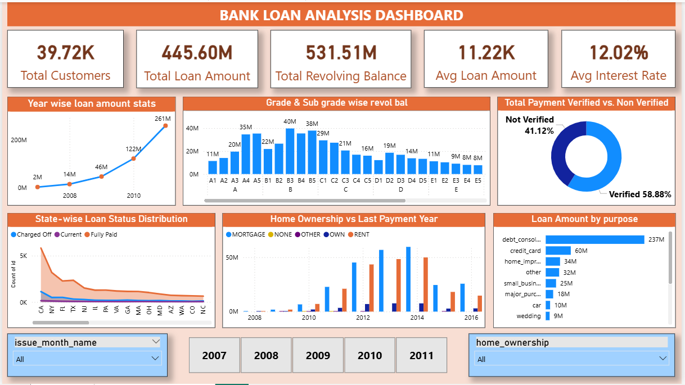

# 📊 Bank Loan Analysis Dashboard

## 📋 Overview

This project focuses on analyzing bank loan data to identify lending patterns, repayment behavior, customer profiles, and potential risk indicators.

The solution was developed using both **Microsoft Excel (Power Pivot, Power Query, DAX)** and **Power BI**, demonstrating end-to-end business intelligence and dashboard development capabilities.

---

## 🎯 Business Objective

Financial institutions require continuous monitoring of loan portfolios to evaluate customer behavior, repayment performance, and overall lending trends.

This dashboard helps stakeholders:

* Monitor loan performance
* Track repayment and default trends
* Analyze customer demographics
* Evaluate verified vs non-verified borrowers
* Understand home ownership patterns
* Support data-driven lending decisions

---

## 🛠 Tools & Technologies

### Excel Dashboard

* Microsoft Excel
* Power Pivot
* Power Query
* DAX Measures
* Pivot Tables
* Pivot Charts
* Slicers

### Power BI Dashboard

* Power BI Desktop
* Power Query
* DAX
* Data Modeling
* Interactive Visualizations

---

## 📂 Dataset Information

| Attribute    | Details                        |
| ------------ | ------------------------------ |
| Domain       | Finance                        |
| Dataset Type | Excel                          |
| Source Files | Finance_1.xlsx, Finance_2.xlsx |
| Records      | 39,000+                        |
| Project Type | Loan Analytics                 |

---

## 📈 Key Performance Indicators (KPIs)

### Excel Dashboard

* Number of Customers
* Average Loan Amount
* Average Interest Rate
* Total Loan Amount
* Default Rate %
* Fully Paid Rate %

### Power BI Dashboard

* Total Customers
* Total Loan Amount
* Total Revolving Balance
* Average Loan Amount
* Average Interest Rate

---

## 💡 Dashboard Insights

### 1. Year-wise Loan Amount Analysis

Tracks growth in loan disbursement across years and identifies lending trends.

### 2. Grade & Sub-grade Wise Revolving Balance

Analyzes revolving balance distribution across customer grades and risk categories.

### 3. Verified vs Non-Verified Payment Analysis

Compares payment contribution between verified and non-verified customers.

### 4. State-wise Loan Status Distribution

Evaluates loan performance and customer distribution across states.

### 5. Home Ownership vs Last Payment Year

Analyzes repayment activity across different home ownership categories.

### 6. Loan Amount by Purpose

Identifies major loan utilization categories such as:

* Debt Consolidation
* Credit Card
* Home Improvement
* Small Business
* Major Purchase
* Car Loan

---

## 🚀 Skills Demonstrated

* Data Cleaning
* Data Transformation
* Data Modeling
* Power Query
* Power Pivot
* DAX
* Dashboard Development
* Financial Analytics
* Business Intelligence
* Data Visualization

---

## 🖼 Dashboard Screenshots

### Excel Dashboard

### Power BI Dashboard

---

## 📌 Project Outcomes

* Improved visibility into loan performance metrics
* Identified repayment and default trends
* Supported lending strategy analysis
* Built interactive dashboards in both Excel and Power BI

---

## 👩‍💻 Author

Priya Nair
